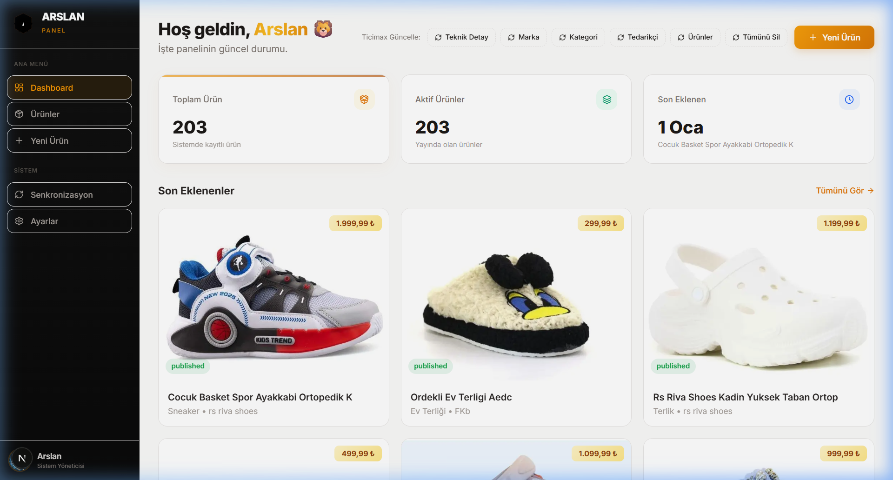
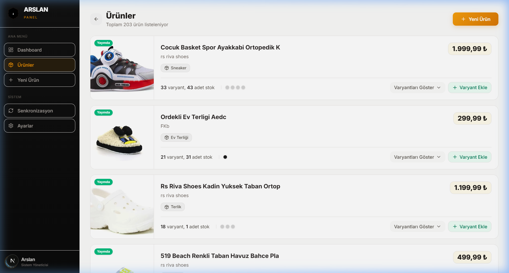

# 🚀 Arslan Panel | Ürün Yönetim Sistemi

[](https://nextjs.org/)
[](https://tailwindcss.com/)
[](https://firebase.google.com/)
[](https://openai.com/)
[](https://vitest.dev/)

**Arslan Panel**, Arslan ailesine özel olarak tasarlanmış, Ticimax altyapısıyla tam entegre çalışan, yapay zeka destekli gelişmiş bir ürün yönetim platformudur.

---

## 📸 Ekran Görüntüleri

<p align="center">
  
  
</p>

---

## 🛡️ Üretim Güvenlik Katmanı (Safety Trio)

Bu proje, "Önce Güvenlik" (Safety-First) mimarisiyle sıfırdan revize edilmiştir:

- **🔄 Akıllı Retry (Exponential Backoff):** Ticimax SOAP ve OpenAI API çağrılarında oluşan anlık ağ hatalarına karşı otomatik yeniden deneme mekanizması.
- **📜 Yapılandırılmış Loglama:** Üretim ortamında tam izlenebilirlik sağlayan, zaman damgalı ve bağlam duyarlı `logger` sistemi.
- **🧯 Merkezi Hata Yönetimi:** Tüm API rotalarında standartlaştırılmış (`handleApiError`) hata yakalama ve güvenli yanıt dönme altyapısı.
- **🏥 Fail-Safe Mekanizmaları:** AI kategorizasyon hatalarında otomatik "Güvenli Kategori" (Fallback) desteği ve sinsi "Duplicate ID" hatalarında otomatik kurtarma (Recovery).

---

## ✨ Öne Çıkan Özellikler

- 🤖 **AI Destekli İçerik:** OpenAI entegrasyonu ile otomatik ürün açıklamaları ve SEO optimizasyonu.
- 🔄 **Ticimax Senkronizasyonu:** SOAP API üzerinden anlık stok, fiyat ve ürün güncelleme.
- 📦 **Tedarikçi Yönetimi:** Akıllı ID kurtarma mantığı ile çakışmasız tedarikçi ve marka senkronizasyonu.
- 🏷️ **Akıllı SKU ve Barkod:** Özelleştirilebilir kurallarla dinamik SKU ve barkod oluşturma sistemi.
- 🧹 **Hızlı Temizlik:** Tek tıkla ürün silme (Wipe) ve veritabanı optimizasyonu.
- 📂 **Kategori Yönetimi:** Ticimax kategorileri ile yerel veritabanı arasında akıllı eşleştirme.
- 🎨 **Modern Arayüz:** Next.js 16 ve Tailwind CSS 4 ile güçlendirilmiş, premium kullanıcı deneyimi.

---

## 🧪 Kalite ve Kararlılık

Proje, **%80+ iş mantığı (Logic) kapsamı** ile test edilmiştir:
- **Unit Tests:** SKU üretimi, XML parçalama ve doğrulama yardımcıları.
- **Integration Tests:** Ürün oluşturma -> Ticimax XML payload -> Veritabanı eşleşme akışları.
- **Edge-Case Validation:** Boş API yanıtları, hatalı kimlik bilgileri ve ağ kesintileri senaryoları.

```bash
# Testleri ve kapsam raporunu çalıştırın
npm run test:coverage
```

---

## 🗺️ Yol Haritası

- [x] Firebase Entegrasyonu (Auth & Firestore)
- [x] OpenAI ile İçerik Oluşturma
- [x] Üretim Güvenlik Katmanı (Safety Hardening)
- [x] Entegrasyon Testleri ve %80+ Kapsam
- [ ] Toplu Ürün Yükleme (CSV/Excel)
- [ ] Mobil Uygulama Desteği

---

## 🛠️ Teknoloji Yığını

| Alan | Teknoloji |
| :--- | :--- |
| **Framework** | [Next.js 16 (App Router)](https://nextjs.org/) |
| **Backend/DB** | [Firebase & Cloud Firestore](https://firebase.google.com/) |
| **Yapay Zeka** | [OpenAI API](https://openai.com/) |
| **Test** | [Vitest (Logic-First Testing)](https://vitest.dev/) |
| **Stil** | [Tailwind CSS 4](https://tailwindcss.com/) |
| **Animasyon** | [Framer Motion](https://www.framer.com/motion/) |

---

## 🚀 Başlangıç

### 1. Kurulum
```bash
git clone https://github.com/kullanici/arslan-panel.git
cd arslan-panel/ticimax-panel
npm install
```

### 2. Ortam Değişkenleri
`.env.local` dosyasını oluşturun:
```env
TICIMAX_DOMAIN=https://your-domain.com
TICIMAX_USER=your_user
TICIMAX_PASS=your_pass
OPENAI_API_KEY=your_key
# Firebase Admin credentials...
```

---

## 🔒 Güvenlik
Kritik işlemler (Ticimax push, DB write) sunucu tarafında (API Routes) yürütülür ve her adım `utils/safety.ts` üzerinden geçirilerek valide edilir.

---

## 📝 Lisans
Bu proje **Arslan Ailesi** için özel olarak geliştirilmiştir. Tüm hakları saklıdır.

<p align="center">
  Geliştirilmiş <b>Premium & Resilient</b> Deneyim - Arslan Panel
</p>
